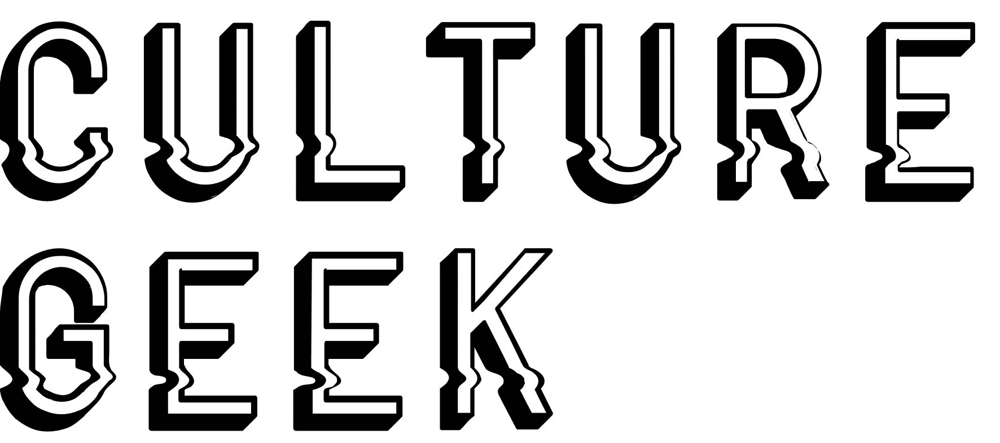

# Hackhathon Challenge: Movie Geek

### Problemática

Últimamente, hay un boom de películas sci-fi nuevas y remakes.

  
Hay muchas personas que son ávidas de este tipo de películas y les gusta disfrutarlas, calificarlas, criticarlas y compararlas

  

Necesitan un lugar específico donde puedan conseguir el tipo de información que buscan de sus películas favoritas y las que las atraen.
  

### Usuario

#### Validación de la idea

  

  Julio tiene 25 años y es un geek ávido de películas sci-fi. Le atrae el aspecto audiovisual de este tipo de películas. Es detallista, selectivo y exigente en cuanto a las películas que ve y las investiga antes de verlas. Le interesa la calificación de las películas con una vista estadísticamente gráfica (del 1 al 5, del 1 al 10, 5 estrellitas o un dedito arriba).
  

### De que se trata el producto

El concepto del producto que estamos desarrollando es una web app que te permite obtener información acerca de películas del genero ciencia ficcion y ademas de ello te permite valorar y ver criterios específicos tales como: guión, cinematografía y soundtrack. Teniendo en cuenta que nuestro usuario es muy meticuloso para buscar información.

### Organización del trabajo

Scketch, de acuerdo al perfil del usuario hemos planteado un sketch que tiene un flujo de las vistas a las que este puede acceder. Imagen scketch:
  

## Recursos utilizados

* jQuery
* Bootstrap 4
* Firebase
* OMDB API
