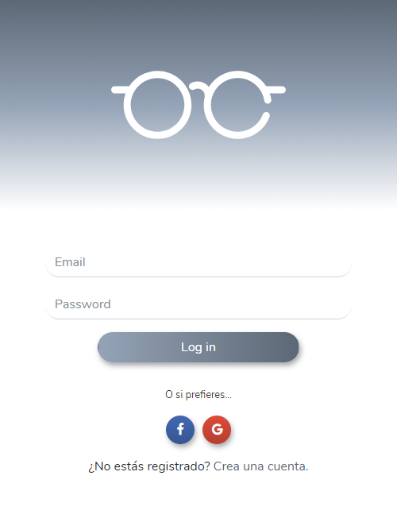

# Hackhathon Challenge: Movie Geek

**Movie Geek** es una web app que te permite obtener información acerca de películas del genero ciencia ficcion y ademas de ello te permite valorar y ver criterios específicos tales como: guión, cinematografía y soundtrack. Teniendo en cuenta que nuestro usuario es muy meticuloso para buscar información.

***

### Desarrollo del producto

Para desarrollar el producto seguimos el siguiente flujo de trabajo:

#### 1 . Identicación del problema:

Últimamente, hay un boom de películas sci-fi nuevas y remakes.
Hay muchas personas que son ávidas de este tipo de películas y les gusta disfrutarlas, calificarlas, criticarlas y compararlas.

Necesitan un lugar específico donde puedan conseguir el tipo de información que buscan de sus películas favoritas y las que las atraen.

#### 2. Identificación del Usuario:

  Julio tiene 25 años y es un geek ávido de películas sci-fi. Le atrae el aspecto audiovisual de este tipo de películas. Es detallista, selectivo y exigente en cuanto a las películas que ve y las investiga antes de verlas. Le interesa la calificación de las películas con una vista estadísticamente gráfica (del 1 al 5, del 1 al 10, 5 estrellitas o un dedito arriba).

  

#### 3. Entrevista a los usuarios:

#### 4. Elaboración del sketch:

  De acuerdo al perfil del usuario hemos planteado un sketch que tiene un flujo de las vistas a las que este puede acceder.

#### 5. Testeo con el usuario:

#### 6. Diseño UI:

  En este punto definimos la paleta de colores, el diseño de lo botones,  el diseño de los inputs y la tipografía .

### Organización del trabajo

Para elaborar el producto las tareas fueron distribuidas de la siguiente manera:

#### Primera sesión:

En la primera sesión nos distribuimos las maquetación de las vistas del producto.

Registro + login -> Andrea

Home + buscador -> Kathy

Información de las películas -> Shannon

Vista perfil -> Lizbeth

#### Segunda sesión:

En la segunda sesión nos distribuimos la funcionalidad de las vistas del producto.

Filtro por género -> Andrea y Kathy

Terminar maquetación -> Shannon y Liz

Terminar login con email -> Andrea

Diseño responsive -> Shannon

#### Tercera sesión:

En la tercera sesión nos distribuimos la funcionalidad y diseño de las vistas del producto.

Vista detalle (jalar data) -> Kathy y Andrea

Pasar información de movie-info a user-profile -> Liz

Unificar estilos -> Shannon

### Recursos utilizados

* jQuery
* Bootstrap 4
* Firebase
* OMDB API

### Integrantes:

* Andrea Chumioque
* Lizbeth Felix
* Katherine Lévano
* Shannon Rivera

### Resultado:

