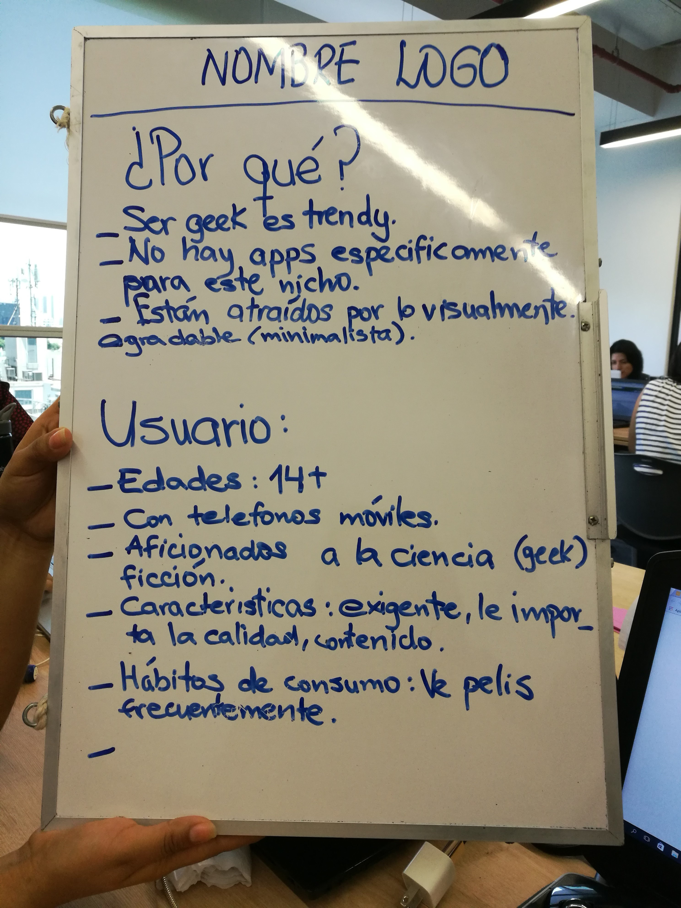
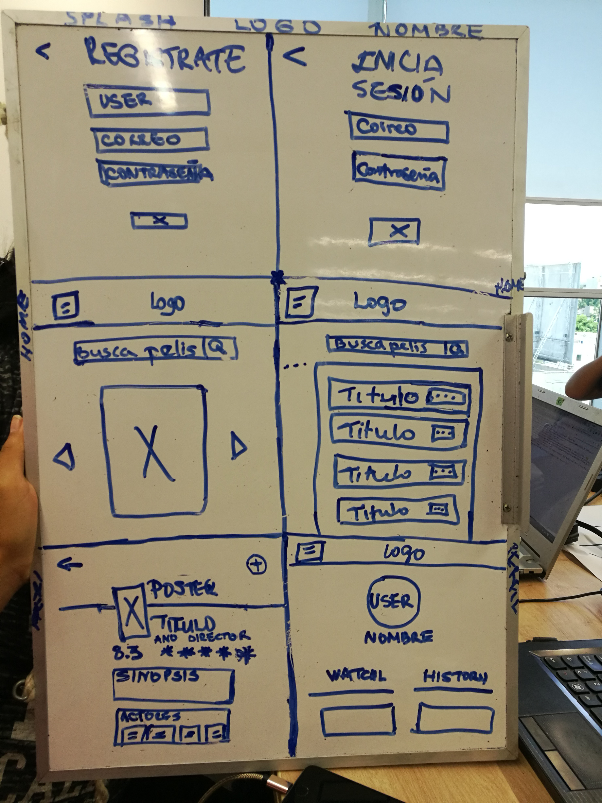
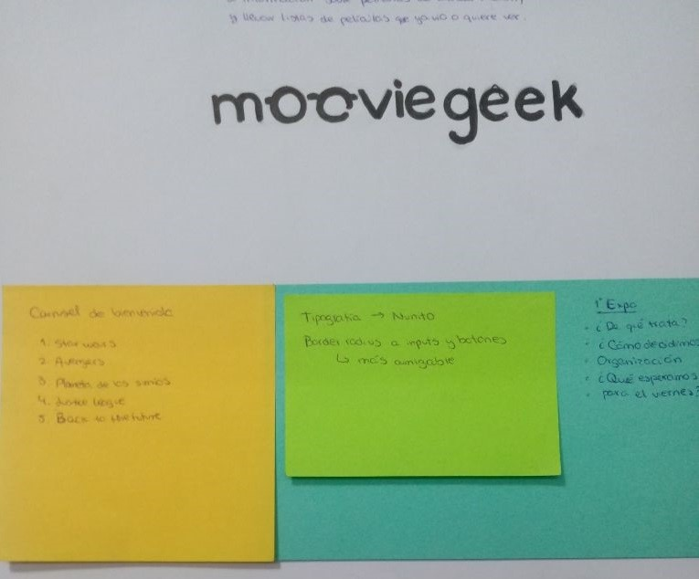
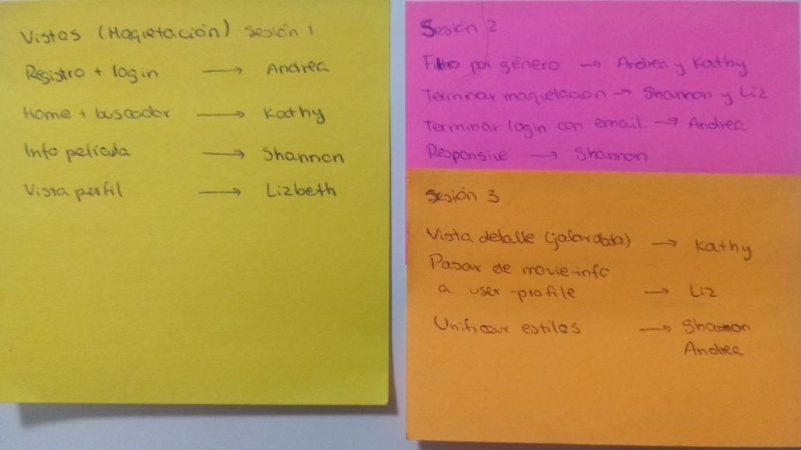
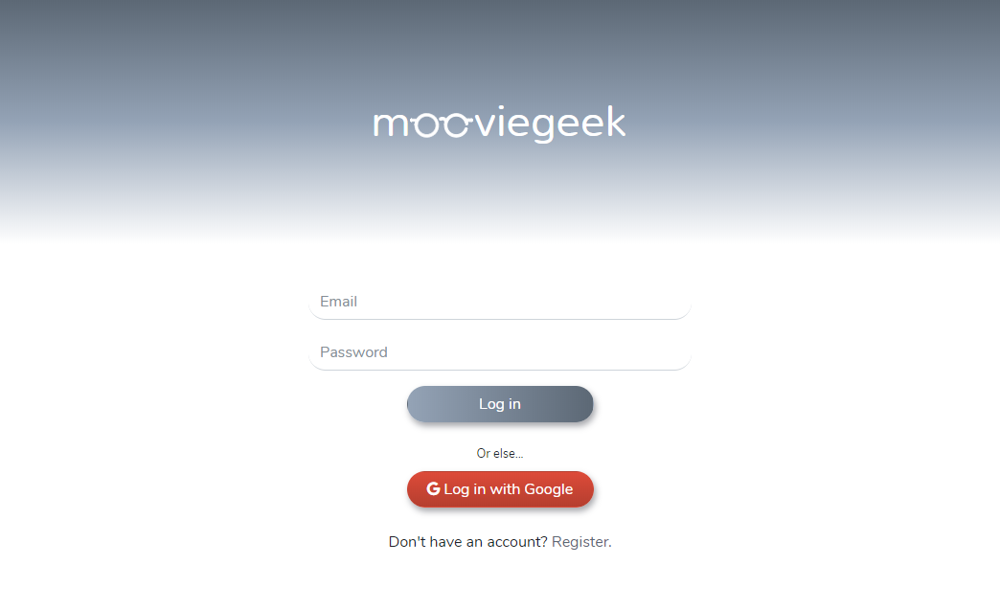
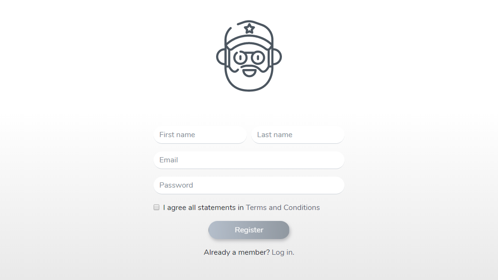
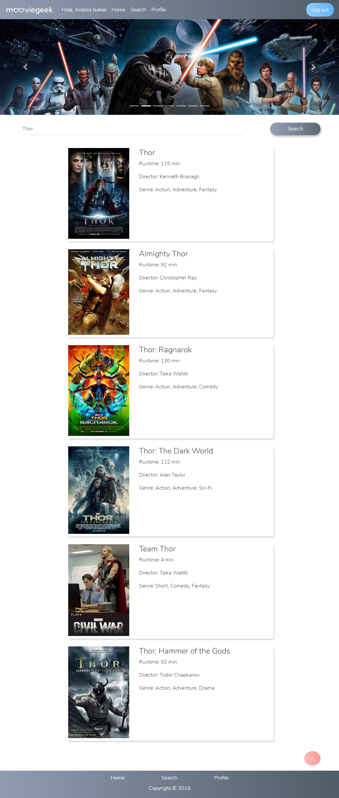

# Hackhathon Challenge: Movie Geek

**Movie Geek** es una web app que te permite obtener información acerca de películas del genero ciencia ficción, ademas de poder agregar a tus listas las películas que quieres ver en el futuro y aquellas que ya viste.

***

### Desarrollo del producto

Para desarrollar el producto seguimos el siguiente flujo de trabajo:

#### 1 . Identicación del problema:

  Hay un boom de películas sci-fi últimamente, en las que se incluyen películas de superhéroes. En este boom, hay tanto películas nuevas como remakes. Hay muchas personas que son ávidas de este tipo de películas y les gusta ver los remakes, como Star Wars y Planeta de los simios, o las películas nuevas de ciertos estudios cinematográficos, como Marvel studios y Warner Bros. Pictures en alianza con DC Entertainment. Entonces hay muchas personas que les gusta ir a verlas, disfrutarlas, calificarlas, criticarlas y compararlas. Al tener esta atracción, necesitan un lugar específico donde puedan conseguir el tipo de información que quieren tener de sus películas favoritas y las que las atraen.

#### 2. Identificación del Usuario:
  La persona que busca esta información suele ser conocedora, sino experta en la materia. Por ejemplo, Julio, quien es diseñador gráfico, tiene 25 años y es un geek ávido de películas sci-fi. Él conoce el director, los actores, les interesa la cinematografía (si los colores son cálidos o fríos), la banda sonora y el compositor, como Hans zimmer en la película The dark knight Rises, Interstellar y The amazing Spiderman o el duo musical Daft Punk para Tron. Le atrae el aspecto audiovisual de este tipo de películas. Es detallista, selectivo y exigente en cuanto a las películas que ve y las investiga antes de verlas en blogs, páginas web que no contengan spoiler y sean imparciales. Le interesa la calificación de las películas con una vista estadísticamente gráfica (del 1 al 5, del 1 al 10, 5 estrellitas o un dedito arriba). Necesita obtener información relativamente general pero precisa de las películas que les gusta.

  

#### 3. Entrevista a los usuarios:
  Se realizó una entrevista a 2 usuarios con la siguiente lista de preguntas:
  * ¿Por qué te gustan las películas sci-fi?
  * ¿Qué quieres encontrar cuando buscas información de una película de sci-fi?
  * ¿Qué te gusta encontrar cuando buscas información de una película de sci-fi?
  * ¿Qué te molesta no encontrar cuando buscas información de una película de sci-fi?
  * ¿Qué es lo primero en que te fijas cuando ves una app o web de información de una película sci-fi?
  * ¿Cuál es la mejor y la peor app o página web que brinde información sobre películas sci-fi? ¿Por qué?
  * ¿Qué clase de información te gustaría encontrar acerca de una película sci-fi?
  * ¿Dónde ves este tipo de películas y por qué?
  * ¿Vas a verlas solo o acompañado? ¿Con quién?

  Con estas preguntas, se logró entender y perfilar los intereses y problemas que tenían los usuarios cuando buscaban información de una película sci-fi. Por ejemplo, se notó que son personas selectivas en cuanto a las películas sci-fi que veían en cuanto al guión que debía representar coherencia y enrequecimiento cultural o científico. Se fijan en el arte promocional, como los posters, la clase de sinopsis que se presenta y los comentarios de otros usuarios, los que no deben ser muy reveladores, el logo de la app o web que visitan, la presentación de información general, pero específica, la calificación de otros usuarios mediante diferentes tipos de demostraciones, como estrellitas, puntuación del 1 al 5 o del 1 al 10, dedito arriba o algún otro tipo de iconografía. Suelen buscar información sobre diferentes categorías, pero en ambos casos, coincidieron en tener un interés por el guión, la cinematografía y el soundtrack. Asimismo, al buscar información de películas sci-fi suelen alternar entre diferentes fuentes, como blogs y páginas web, pero que suelen tener spoilers, ya sea en la sinopsis o en la sección de comentarios de otros usuarios, además de que carecían de algún u otro dato específico como las categorías previamente mencionadas u otras, como datos curiosos de las películas, si estas contenían escenas post-créditos, alertar acerca de los próximos estrenos, películas relacionadas y permitirles llevar un registro de las películas que les gustan y que ya han visto.

#### 4. Elaboración del sketch:

  De acuerdo al perfil del usuario hemos planteado un sketch que tiene un flujo de las vistas a las que este puede acceder.

#### 5. Testeo con el usuario:
  Se mostró el sketch a los usuarios para ver si les resultaba útil la distribución de la propuesta de la web app. La mayoría de la distribución y funcionalidad fue entendida y aceptada, excepto la ubicación de los íconos que permitirían agregar una película a su lista de películas por ver y las que ya han visto. Sugirieron ubicarlos debajo del título, duración, director y género de la película, en vez de estar sobre la imagen del poster.
  En base a este feedfack, se procedió a hacer las modificaciones respectivas.

#### 6. Diseño UI:

  En este punto definimos el logo, la paleta de colores, el diseño de los botones,  el diseño de los inputs y la tipografía .

### Organización del trabajo

Para elaborar el producto las tareas fueron distribuidas de la siguiente manera:

#### Primera sesión:

En la primera sesión nos distribuimos las maquetación de las vistas del producto.

Registro + login -> Andrea

Home + buscador -> Kathy

Información de las películas -> Shannon

Vista perfil -> Lizbeth

#### Segunda sesión:

En la segunda sesión nos distribuimos la funcionalidad de las vistas del producto.

Filtro por género -> Andrea y Kathy

Terminar maquetación -> Shannon y Liz

Terminar login con email -> Andrea

Diseño responsive -> Shannon

#### Tercera sesión:

En la tercera sesión nos distribuimos la funcionalidad y diseño de las vistas del producto.

Vista detalle (jalar data) -> Kathy y Andrea

Pasar información de movie-info a user-profile -> Liz

Unificar estilos -> Shannon

### Recursos utilizados

* jQuery
* Bootstrap 4
* Firebase
* OMDB API

### Integrantes:

* Andrea Chumioque
* Lizbeth Felix
* Katherine Lévano
* Shannon Rivera

### Resultado:

